Before you read this, see disclaimer in [README](../README.md)

# 1. Install Linux, gcc/g++
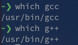

# 2. Swap numbers/pointers
## Swap 2 numbers are correct
```
#include <stdio.h>

void swap_nums(int *x, int *y) {
    int tmp;
    tmp = *x;
    *x = *y;
    *y = tmp;
}

int main(){
    int a,b;
    a = 3; b=4;
    swap_nums(&a,&b);
    printf("a is %d\n", a);
    printf("b is %d\n", b);

    return 0; 
}
```
Output (correct):

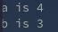

## Swaps 2 pointers are wrong 
```
#include<stdio.h>

// this function needs modification
void swap_pointers(char *x, char *y) { 
    char *tmp;
    tmp = x;
    x = y;
    y = tmp;
}

int main(){
    char *s1,*s2;
    s1 = "I should print second";
    s2 = "I should print first";
    swap_pointers(s1,s2); // problem here 
    printf("s1 is %s\n", s1);
    printf("s2 is %s\n", s2);

    return 0;
}
```
Output (wrong): 

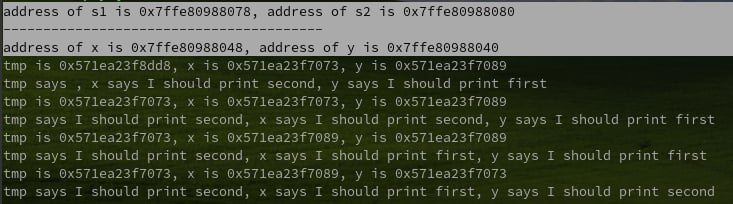

The address of the `char*` object outside of the `swap_pointers()` function is different from the address of those objects inside the function. 

This is because by default, C/C++ pass by value, meaning if an object X is passed into a function, a copy of X is made for the function to work with, and X itself stays unmodified. This contrasts with Java who passed the reference to the object by default. 

As seen above, to swap 2 integers, we pass in pointers to those integers. Similarly, to swap 2 pointers, we need to pass in the pointers to the pointers. And the `swap_pointers()` function needs to be modified to handle pointers to pointers. 
```
#include<stdio.h>

// this function needs modification
void swap_pointers(char** x, char** y) { 
    char* tmp;
    tmp = *x;
    *x = *y;
    *y = tmp;
}

int main(){
    char *s1,*s2;
    s1 = "I should print second";
    s2 = "I should print first";
    swap_pointers(&s1,&s2); // modified here
    printf("s1 is %s\n", s1);
    printf("s2 is %s\n", s2);

    return 0;
}
```
Output (correct): 

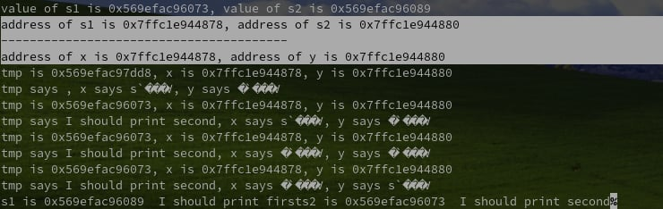

Note how the address of the pointers are the same inside and outside of the function. 

# 3. Find & fix segmentation fault 
```
#include <stdio.h>

int main() {
    char **s;
    char foo[] = "Hello World";
    *s = foo;
    printf("s is %s\n",s);

    s[0] = foo;
    printf("s[0] is %s\n",s[0]);
    
    return(0);
}
```
`*s = foo` is the same as `s[0] = foo`, both can be de-sugarcoated to be `*(s + 0) = foo`. 

Nothing should be wrong for the first 2 lines in main. So the line to cause the segmentation fault is `*s = foo`. 

To investigate the behavior, we can wrap the problematic line in print statements: 

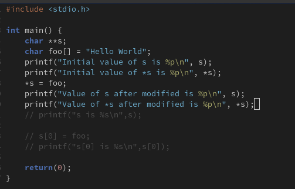

Output (wrong): 
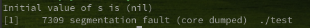

Before even executing the problematic line, the second print statement produces a segmentation fault. The previous print reveals that `s` was a null pointer, which explains why dereferencing it was not permitted. 

The segmentation fault was caused by dereferencing a null pointer. To fix this, we make sure to initialize s to a valid pointer value before attempting to dereference it. 

The corrected code is: 
```
#include <stdio.h>

int main() {
    char **s;

    //char foo[] is wrong but char* foo is right
    char* foo = "Hello World";

    s = &foo;
    printf("s is %s\n",s);

    s[0] = foo;
    printf("s[0] is %s\n",s[0]);
    
    return(0);
}

```
Output (correct): 

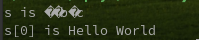

Note: 
## Note: char* foo and char foo[]

`char* foo` and `char foo[]` are not equivalent. Thanks to this exercise and the main sources listed below, I have found out that there is a distinction between an array of characters and a string literal. 

`char* foo` is an explicit pointer declaration. `foo` here is of type char*--a pointer. 

`char foo[]` is an array declaration. When passed into a general function, ie. `function(foo)`, then `foo` will be decayed into a pointer as if it was declared as `char* foo`, but when passed into certain function like `sizeof()`, then `foo` will not be decayed. 
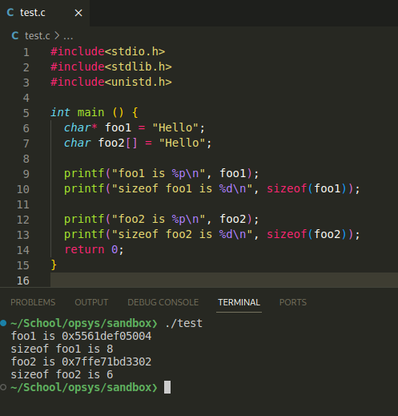

Resources: 
- https://stackoverflow.com/questions/30533439/string-literals-vs-array-of-char-when-initializing-a-pointer 
- https://www.reddit.com/r/C_Programming/comments/jjdl7s/difference_between_char_and_char/ 

# 4. Retrieve SP and PC 
```
int main() {
    void* sp 
    void* pc 

    __asm__("mov %%rsp, %0" : "=r"(sp)); 
    printf("Stack pointer is at %p\n", sp);

    __asm__("lea (%%rip), %0" : "=r"(pc)); 
    printf("Program counter is at %p\n", pc); 

    printf("SP - PC = %d\n", sp-pc); 

    return(0); 
}
```
The code runs assembly inside the `__asm__()` function. The syntax of this function is as follows: 
`__asm__ ( "assembly code" : output operands);
`
- `mov %%rsp, %0`: tells the processor to move the value of the register holding stack pointer into the current register (to keep the SP location value)
- `"=r"(sp)`: `"="` tells that this is an output value; the output is written into a standard register `"=r"`, and the C/C++ variable to store this value is `sp`
- `lea (%%rip), %0`: load effective address of the register instruction pointer (current instruction) into the current register
- `"=r"(pc)`: stores the result in `pc` variable

Output: 

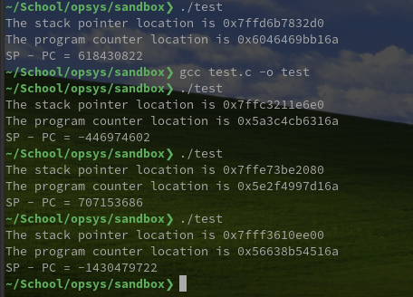

If it returns positive forever, I might not be able to conclude that it is **always** positive. But since there exists at least one negative instance, I can say it is **not always** positive. 

# 5. Finding stack pointer 
I did this under the assumption that the newest `malloc()` call gives me the "top" of the heap. 
```
#include<stdio.h> 
#include<stdlib.h> 

int main () {
  void* hp = (int *) malloc(sizeof(int)*5); 
  printf("hp is at %p\n", hp);
  free(hp);
  printf("hp is free %p\n", hp); 
  return(0); 
}

```
Output:

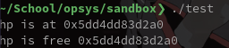

But after some quick reads it seems like I cannot be **certain** that what `malloc()` returns will be the top of the heap. Heap could be fragmented. 
```
#include<stdio.h> 
#include<stdlib.h> 
#include<unistd.h> 

int main () {
  void* sp;
  void* pc;

  __asm__("mov %%rsp, %0" : "=r"(sp)); 
  printf("Stack pointer is at %p\n", sp);

  __asm__("lea (%%rip), %0" : "=r"(pc)); 
  printf("Program counter is at %p\n", pc); 

  // 1048576 is 1024*1024 to convert to MB 
  printf("SP - PC = %d MB\n", (sp-pc)/(1048576));

  void* hp = (int *) malloc(sizeof(int)*5); 
  printf("hp is at %p\n", hp);
  printf("SP - HP = %d MB\n", (sp-hp)/(1048576)); 
  free(hp);

  void* sbr = (int *) sbrk(0); 
  printf("sbrk(0) returns %p\n", sbr);
  printf("SP - SBR = %d MB\n", (sp-sbr)/(1048576)); 
  return(0); 
}

```
Output: 

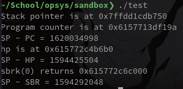
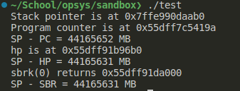

~~I am unable to tell which one is the top of the heap :D~~ 

The heap gets fragmented and so the difference between SP and HP is not a reliable indicator of the shared "free space" in the process' address space. The more I learn and think about it, the idea of a "top of a stack" or "top of a heap" is a very nice abstraction for my beginner brain, but under the hood memory isn't a nice contiguous chunk. 

Resources: 
- Dynamic Memory Allocator misuse & `ptmalloc()`: https://docs.google.com/presentation/d/16XMoNQQB_jP0odRvQFhgMi3Neo9VR0g1jBvBXKYBnh0/edit#slide=id.g8662b4d4c3_0_0 
- The illusion of a contiguous memory chunk is provided by Virtual Memory mechanism: https://en.wikipedia.org/wiki/Virtual_memory 

# 6. Handling Ctrl+C 
`signal(SIGINT, interruptHandlerFunction)` "binds" the `interruptHandlerFunction()` to the `SIGINT`, whenever SIGINT is emitted, the designated function will be called to handle the interrupt signal. (This mechanism is mimicked in Qt's Signal-Slot mechanism to emit signal and dispatch event handler). 

`exit(0)` terminates the current program and returns status code 0 indicating a successful program execution. 

Replacing the `exit(0)` with some print statements makes it impossibe to interrupt the program using the keyboard: 

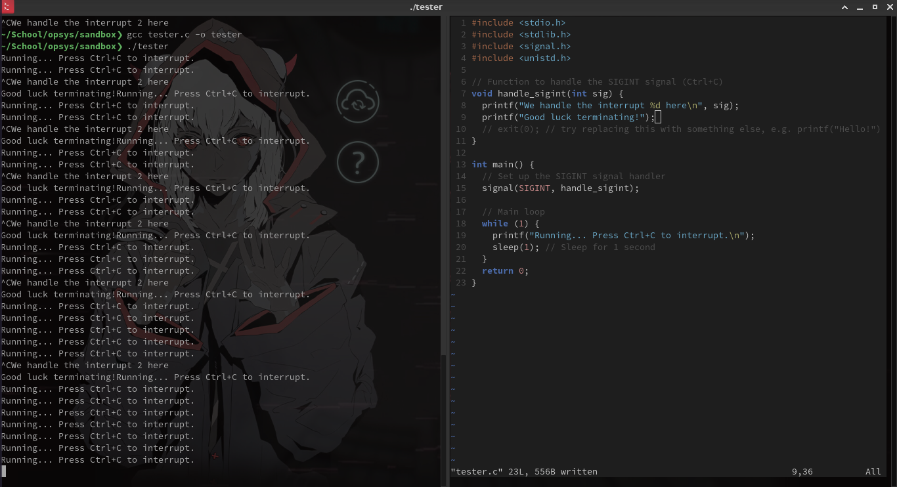

Resources: 
- https://man7.org/linux/man-pages/man7/signal.7.html 
- https://man7.org/linux/man-pages/man2/signal.2.html
- GNU's info page is a more detailed document on everything manpage covers but I did not use to do this assignment. 