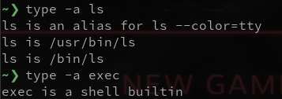

Before you read this, see disclaimer in [README](../README.md)

# 1. exec ls 


Running `exec ls` resulted in the shell being closed. This makes sense because `exec` replaces the current process (of the terminal) with the new process of `ls`. 

Process `ls` does run, but there is no STDOUT to dump result. 

`exec` manual page tells us this: 


This behavior can be seen also by running `bash -c "exec ls"`: 


This forks a new shell from current shell, and the STDOUT of the new shell is connected to the STDOUT of the calling shell (file descriptor 1). The new `bash` process is replaced by `ls` process, and the output is written to the screen of the calling shell. 

# 2. Number of processes
```
void main (int argc, char ** argv) {
    forkthem(6);
}
void forkthem (int n) {
    if (n > 0) {
        fork();
        forkthem(n-1);
    }
}
```

The `main` process will call `forkthem()` 6 times, each with $n=6, 5, ..., 2, 1$. 

`forkthem(n)` calls $n$ `fork()`, therefore: 
- `forkthem(6)` calls `fork()` 6 times, which creates $2^6$ processes.
- `forkthem(5)` calls `fork()` 5 times, which creates $2^5$ processes.
- ...
- `forkthem(1)` calls `fork()` 1 times, which creates $2^1$ processes.

Add them all together: 
$$ 2^6 + 2^5 + ... + 2^1 = 2^7 - 1 - 2^0 = 126 $$
So there are 126 processes created from this code. 

# 3. Number of processes & value of variable
```
void main (int argc, char** argv) {
    int child = fork();
    int x = 5;
    if (child == 0) {
        x += 5;
    }
    else {
        child = fork();
        x += 10;
        if (child) {
            x += 5;
        }
    }
}
```
This code creates 3 processes: 
- `main` process init `x=5`, then jumps into `else`, then increase `x=5+10=15`, then jumps inside if again to make `x=15+5=20` --> in main process, `x=20`
- the first `fork()` create child 1, init `x=5`, goes into if to make `x=5+5=10` --> in first child, `x=10`
- the second `fork()` was created from `main` process, `x=5` as copied from `main`, then increase to `x=5+10=15`, not going inside if again --> in second child, `x=15`

See this illustration for better understanding: 


# 4. Guess output & find out
`wait()` system call document: 


## Program 1
```
// program 1
void main() {
    int val = 5;
    int pid;
    if (pid = fork())
        wait(pid);
    val++;
    printf("%d\n", val);
}
```
### Prediction:
An error as `wait(pid)` is not defined. `waitpid(pid)` accepts a `pid` argument, but `wait()` is not. 

If no error --> `pid` is ignored (which might happen as system calls are old code written from the far past), then the code prints "6" twice, first "6" printed from child process, second "6" printed from parent process. 

This happens because there are 2 possible cases when `wait()` is called: 
- If the calling process has at least 1 child process, `wait()` waits for any of the child to finish and then resume computation.
- If the calling process has no child, `wait()` does nothing as if it's not there.

### Actual result: 


Ok so old code doesn't mean careless code :) 

I tried fixing the code to get pass the error, to find that my prediction was correct: 


## Program 2
```
// program 2
void main() {
    int val = 5;
    int pid;
    if (pid = fork())
        wait(pid);
    else
        exit(val);
    val++;
    printf("%d\n", val);
}
```

### Prediction
Because I know `wait(pid)` is invalid usage, this code is sure to create the same error. 

To be more interesting, let's assume `wait()` is used correctly. If so, then child will exit immediately with code 5, then in parent process `val++ = 6` and then "6" will be printed out. 

### Actual result
My prediction is correct: 


## Program 3
```
// program 3
void main() {
    fork();
    fork();
    fork();
    printf("hello\n");
    return 0;
}
```
### Prediction 
There will be an error because `main()` returns int when it is supposed to return void. 

In case we delete this return, "hello" will be printed $2^3=8$ times -- print from which process is not easy to determined. 


### Actual result 
My guess is correct but the program exit code 6, which for now I'm not sure why 


In man pages, only these codes are defined: 


In Bash scripting guide, code 6 also isn't specified: https://tldp.org/LDP/abs/html/exitcodes.html#EXITCODESREF 

## Program 4
```
// program 4
void main(){
    printf("A\n");
    fork();
    printf("B\n");
    fork();
    printf("C\n");
}
```
### Prediction 
- "A" is printed once (no fork yet --> only 1 active process)
- "B" is printed twice (1 fork --> 2 active processes)
- "C" is printed 4 times (2 forks --> 4 active processes)

### Actual result 
Yep: 


# 5. Explain output 
## Document of execl, errno, perror
- `execl` belongs to a family of `exec` function, document: https://man7.org/linux/man-pages/man3/exec.3.html 
- `errno` header file lists predefined error numbers & their associated meaning: https://man7.org/linux/man-pages/man3/errno.3.html 
- `perror` prints error number and its associated meaning as defined in `errno`: https://man7.org/linux/man-pages/man3/perror.3.html 

## Explain the output of this
```
#include <stdio.h>
#include <unistd.h>
#include <errno.h>
int main(int argc,char *argv[]) {
    printf("Try to execute lss\n");
    execl("/bin/lls","lls",NULL);
    printf("execl returned! errno is [%d]\n",errno);
    perror("The error message is :");
    return 0;
}
```

Output: 


`execl` first argument is the path to executable we want to use (a command may have more than one executable file installed on the machine) -- so the above command is telling execl to run `lls` with the executable stored at `/bin/lls`. 

`errno` and `perror` works as described above. 

# 6. Create process without zombie 
Code: 
```
#include<stdio.h>
#include<unistd.h> 
#include<sys/wait.h>
#include<stdlib.h>
#include<errno.h>

int main() { 
    int rc = fork(); 
    int status; 
    if (rc==0){
        printf("In process %d, child of %d \n", getpid(), getppid());
        execl("/bin/ls", "ls", NULL); 
    }
    else {
        waitpid(rc, &status, 0); 
        printf("In process %d, parent of %d \n", getpid(), rc);
    }
    return 0; 
}
```

Output: 

