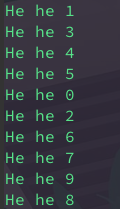

Before you read this, see disclaimer in [README](../README.md)

# 1. Exit behavior 
## a. Run code multiple times, same result? 
No. This is expected behavior because we are not actively controlling thread execution order. 

 
## b. Uncomment exit in foo() and explain 
**Expectation**: 
If I execute this program multiple times, each time it should be able to print a few lines of `He he <number>` before stopping. We will not get exactly 10 lines printed every time as in (a). Any thread that reaches the line `exit(NULL)` first will end execution for all threads. `exit()` terminates the entire process, not just a thread. 

**Actual result**: 

This is the result I expected. 
## c. Uncomment exit in main() and explain. Compare to (b)
**Expectation**: 
All 10 threads will be created before the program exits. The number of lines able to print out to the screen is not guaranteed to be 10 all the time (but it would likely be more than the number of lines printed in b). The explanation is the same as (b). 

**Actual result**: 

 

This result is what I expected. I ran 5-6 times, each time the number of lines printed is around 9-10. This lets me know that the time it takes to create 10 threads is enough to run most iterations of `foo()`. 

# 2. Insert sorted behavior 
## a. Read the code to understand 
Got it. 
## b. Compile & run code with different n & see if it works as expected
**Expectation**:
Here are the things merge sort can do: 
1. The numbers in $sorted(S)$ is organized in ascending order
2. Sort all numbers from the input set to the output array. That is, $\forall x \in S: x \in sorted(S)$

I would not expect this program to do exactly that, because `insert_sorted()` function is shared by both threads, without any locking mechanism to ensure that no race conditions will happen on `sorted_array()` and `size`. 

**Actual result**: 

I wrote a command to check sortedness: 

 

And here are results for small numbers to get a feel of it: 

 
## c. Explain behavior 
Because `insert_sorted()` is not threadsafe, it hard to expect the exact result, thus the above result is not surprising to me. 

Sometimes the output is not sorted: 

Sometimes only odd numbers are printed: 

Sometimes only even numbers are printed: 

Many times it is completely random which number is printed and in what order: 

Since everthing that can go wrong has gone wrong, this makes it really easy to explain: The threads modify shared data `size` and `sorted_array[]` in an uncontrolled manner, making it possible for every error to manifest. 

# 3. Write matmul() 
All code in [matmul.c](matmul.c).
## a. Naive matrix multiplication 
See [matmul.c](matmul.c).

## b. K threads matrix multiplication 
See [matmul.c](matmul.c).

My idea is to make each thread responsible for roughly $\frac{n}{k}$ rows, no 2 threads work on the same row. By partitioning the matrix into non-overlapping parts, the threads will not run into race condition despite not using any kinds of locks. 
## c. Fix dimension(A) = 1000 x 1000, try many values for k, plot the trend
 

For now, I will turn off output matrix printing for brief comparison of time. 

For small inputs, `multi_matmul()` seems to take longer, but the time starts to match as input size grows bigger: 

This is the program's execution time this question ask: Matrix (n x n), number of threads k. My machine only has 4 cores (sadly, I thought it has been 8 all this time)

It's bad, the more thread the longer it runs. But i have faith that as the number of CPU increases the multithreaded program will win :D