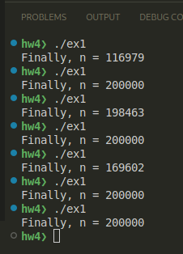
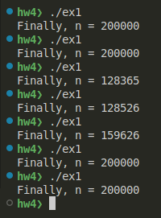
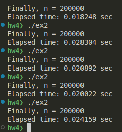
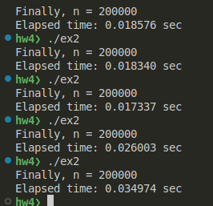
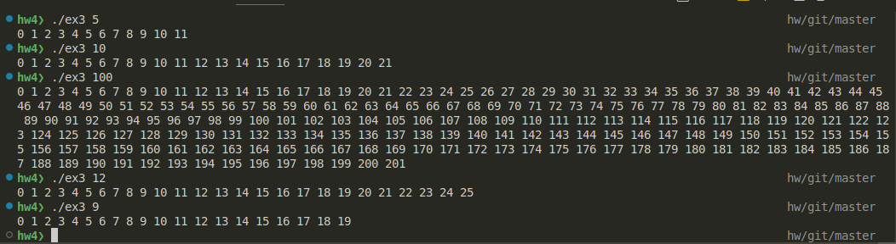
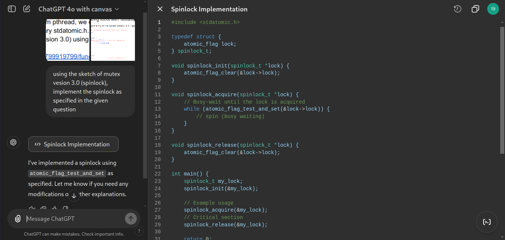
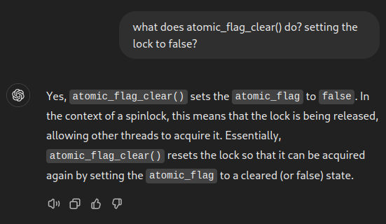
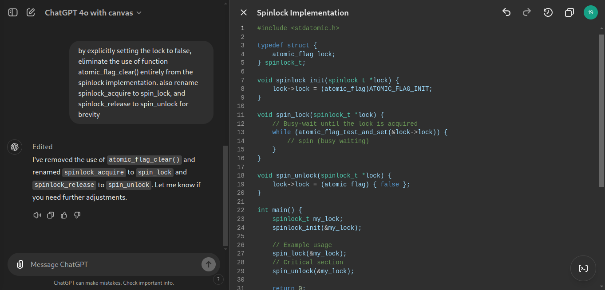
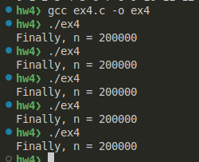
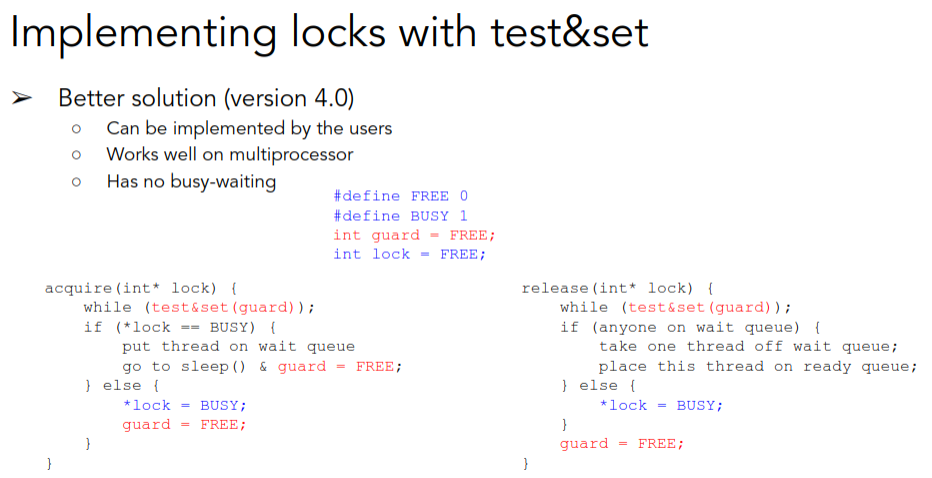

Before you read this, see disclaimer in [README](../README.md)

This assignment was done with the use of AI, as recommended by the instruction file. All usage are described with photo evidence. 

# 1. Non-threadsafe program 
Code is at [ex1.c](ex1.c)

 

The final value is sometimes 200000 and sometimes less than 200000. This is because the program is not threadsafe. There is no explicit mechanism to prevent a race condition between 2 threads.
- If lucky, no 2 threads modify `n` at the same time, then we get `n = 200000` 
- In the regular case, `odd_thread` and `even_thread` tries to increment `n` at the same time, resulting in `n < 200000`

# 2. Fixing program in #1
Code is at [ex2.c](ex2.c). The idea is init a mutex lock in `main`, then lock-unlock the critical section code of each thread (`count++`) to prevent any lost update. 

 

The program ends with `n = 200000` every time.

# 3. Print sequence
The non-threadsafe program is at [hw3_2.c](hw3_2.c)

The threadsafe version is at [ex3.c](ex3.c). Since there are 2 threads, the idea is exactly the same as question 2, using a single mutex lock to ensure only one thread runs critical section code at a time. 

After fixing, the printed sequence prints from $0$ to $2n+1$ as wanted.

# 4. Implement lock with atomic function
Code is at [ex4.c](ex4.c)

### AI prompt 
**Model**: ChatGPT 4o with canvas 

I gave ChatGPT the question of exercise 4, and the spin lock (mutex version 3.0) sketch of the lecture. It gave me the program which used 2 functions `atomic_flag_test_and_set` and `atomic_flag_clear`:

I then asked it to explain the `atomic_flag_clear` function so that I understand how I can eliminate it: 

Then I asked it to eliminate the use of `atomic_flag_clear`: 

I did some minimal editing (ie. using `ATOMIC_FLAG_INIT` instead of boolean literal `false`) and add the code from question 1 to `main()` to test. See [ex4.c](ex4.c) for final spinlock implementation.

# 5. Improving #4 with futex 
Code file at [ex5.c](ex5.c)

Using Mutex lock version 4.0 sketch in the Synchronization lecture: 

### AI prompt 
See full conversations with ChatGPT: 
- ChatGPT 4o: [full conversation](ex5-chatgpt-4o.pdf)
- ChatGPT o1-preview: [full conversation](ex5-chatgpt-o1-preview.pdf)